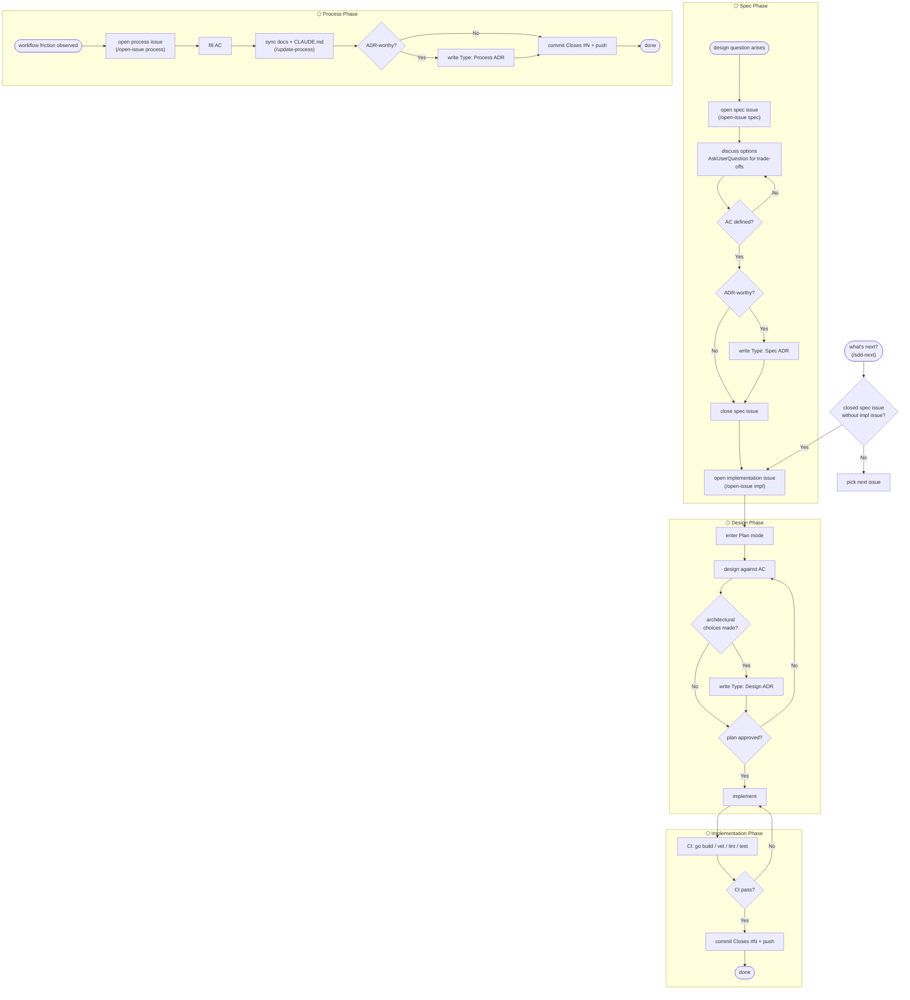

# Development Workflow Diagram

> Updated whenever the development process changes.
> Source of truth for the workflow is [`development.md`](development.md).

```mermaid
flowchart TD
  subgraph Spec ["⬡ Spec Phase"]
    S1([design question arises]) --> S2["open spec issue\n(/open-issue spec)"]
    S2 --> S3[discuss options\nAskUserQuestion for trade-offs]
    S3 --> S4{AC defined?}
    S4 -->|No| S3
    S4 -->|Yes| S4b{ADR-worthy?}
    S4b -->|Yes| S5[write Type: Spec ADR]
    S4b -->|No| S6
    S5 --> S6[close spec issue]
    S6 --> S7["open implementation issue\n(/open-issue impl)"]
  end

  subgraph Design ["⬡ Design Phase"]
    S7 --> D1[enter Plan mode]
    D1 --> D2[design against AC]
    D2 --> D3{architectural\nchoices made?}
    D3 -->|Yes| D4[write Type: Design ADR]
    D3 -->|No| D5{plan approved?}
    D4 --> D5
    D5 -->|No| D2
    D5 -->|Yes| I1
  end

  subgraph Impl ["⬡ Implementation Phase"]
    I1[implement] --> I2["CI: go build / vet / lint / test"]
    I2 --> I3{CI pass?}
    I3 -->|No| I1
    I3 -->|Yes| I4[commit Closes #N + push]
    I4 --> I5([done])
  end

  subgraph Proc ["⬡ Process Phase"]
    P1([workflow friction observed]) --> P2["open process issue\n(/open-issue process)"]
    P2 --> P3[fill AC]
    P3 --> P4["sync docs + CLAUDE.md\n(/update-process)"]
    P4 --> P4b{ADR-worthy?}
    P4b -->|Yes| P5[write Type: Process ADR]
    P4b -->|No| P6
    P5 --> P6[commit Closes #N + push]
    P6 --> P7([done])
  end

  %% Triage rule
  T1(["what's next?\n(/sdd-next)"]) --> T2{closed spec issue\nwithout impl issue?}
  T2 -->|Yes| S7
  T2 -->|No| T3[pick next issue]
```
